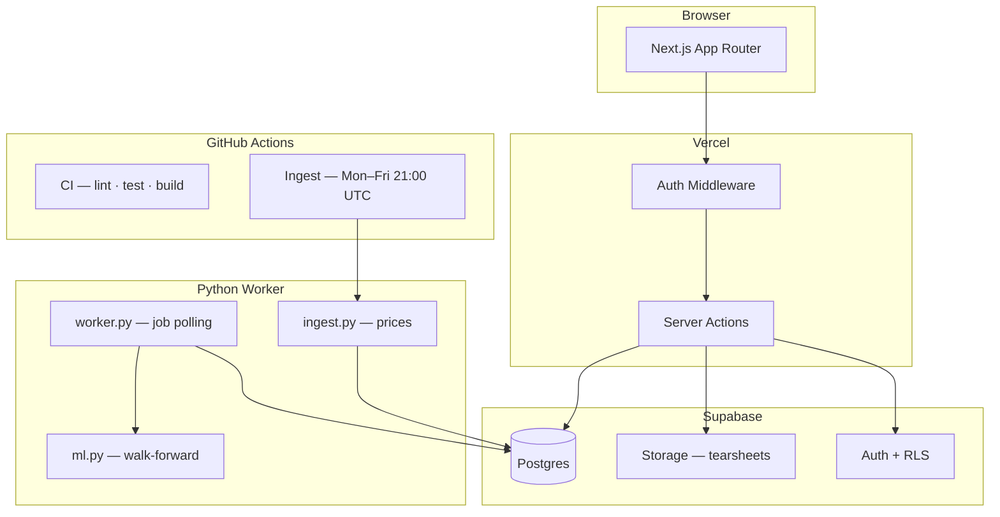

# FactorLab

FactorLab is a hybrid quant research product with:
- Next.js dashboard (`app/`, `components/`)
- Supabase state/results/storage (`supabase/`)
- Python compute engine + worker (`services/engine/`)

## Core Product Scope

- Queue a run from `/runs/new`
- Track job lifecycle in `/jobs` (`queued/running/completed/failed`)
- Inspect results in `/dashboard`, `/runs`, `/runs/[id]`
- Compare strategy snapshots in `/compare`
- Browse strategy methodology and metrics glossary at `/strategies`
- Download HTML tearsheets from run detail

## Architecture



- Frontend: Next.js App Router + TypeScript + Tailwind + shadcn/ui
- Database: Supabase Postgres
- Reports: Supabase Storage bucket (`reports`)
- Compute: Python worker polling `jobs`, writing `equity_curve` + `run_metrics` + `positions`

## Job Lifecycle

- `jobs.status`: `queued | running | completed | failed`
- `jobs.stage`: `ingest | features | train | backtest | report`
- `jobs.progress`: `0..100`
- `jobs.error_message`: persisted worker error for debugging

Worker claims jobs with a conditional status transition (`queued -> running`) to prevent duplicate processing.

## Run Reproducibility

`runs` stores:
- `strategy_id`
- `benchmark_ticker`
- `costs_bps`
- `top_n`
- `universe` (preset label)
- `universe_symbols` (snapshotted symbol list — source of truth for execution)
- `run_params` (JSON)
- date range and status

At execution time the worker snapshots the resolved universe to `runs.universe_symbols`. This prevents config drift between the UI label and actual execution.

---

## Auth & Email Verification Setup

### Supabase Dashboard — URL Configuration

Go to **Authentication → URL Configuration** in your Supabase project and set:

| Setting | Value |
|---|---|
| Site URL (prod) | `https://factor-lab.vercel.app` |
| Site URL (dev) | `http://localhost:3000` |
| Additional redirect URLs | `https://factor-lab.vercel.app/**` and `http://localhost:3000/**` |

> **Note:** The Site URL must match the environment you're testing. Change it when switching between local dev and production, or use the redirect URL wildcard patterns to cover both.

### Environment Variables

```bash
# .env.local (production only — omit for local dev)
NEXT_PUBLIC_SITE_URL=https://factor-lab.vercel.app
```

When `NEXT_PUBLIC_SITE_URL` is not set, the app derives the callback URL from the request `origin` header automatically (works for local dev).

### How the Flow Works

**Email confirmation disabled (dev default):**
1. User signs up → Supabase auto-confirms and returns a live session
2. User is redirected straight to `/dashboard`

**Email confirmation enabled (production):**
1. User signs up → Supabase sends a verification email, returns `session: null`
2. User is redirected to `/login?tab=verify&email=<address>` — verify tab shows instructions + resend button
3. User clicks the email link → lands on `/auth/callback?code=...`
4. Callback exchanges the code for a session and redirects to `/dashboard`
5. **Expired link**: `/auth/callback` redirects to `/login?tab=verify&error=expired` — user can enter their email and resend

### Manual Test Steps

```
# Dev (confirm email OFF in Supabase dashboard)
1. Sign up with a new email → should land on /dashboard immediately

# Prod (confirm email ON)
1. Sign up → redirected to /login?tab=verify
2. Check inbox, click verification link → redirected to /dashboard while signed in
3. Resend: click "Resend verification email" → success message
4. Expired link: paste an old verification URL → /login?tab=verify with error + email input to resend
```

---

## Strategy Glossary & Methodology

### Common Framework

All strategies share the following framework:

| Dimension | Value |
|-----------|-------|
| **Rebalance frequency** | Monthly (calendar month boundaries) |
| **Portfolio construction** | Equal weight — each selected asset receives weight 1/k |
| **Transaction cost model** | `cost = (costs_bps / 10,000) × turnover`, deducted at each rebalance |
| **Default costs** | 10 bps (configurable per run) |
| **Benchmark** | SPY, rebased to starting NAV of $100,000 |
| **Starting NAV** | $100,000 for both portfolio and benchmark |

**Universe resolution** (priority order):
1. `runs.universe_symbols` snapshot (if already set — the source of truth)
2. Named preset from `runs.universe` (ETF8 / SP100 / NASDAQ100)
3. `FACTORLAB_UNIVERSE` env variable
4. Default: ETF8

**Available universe presets:**
- **ETF8**: 8 cross-asset ETFs — SPY, QQQ, IWM, EFA, EEM, TLT, GLD, VNQ
- **SP100**: 20 large-cap S&P 500 members (AAPL, MSFT, AMZN, GOOGL…)
- **NASDAQ100**: 20 Nasdaq-100 technology leaders (AAPL, MSFT, NVDA, AMZN…)

---

### equal_weight

**Rule:** At each monthly rebalance, assign weight 1/N to all N assets in the universe. No selection filtering — every asset is held.

| Field | Detail |
|-------|--------|
| Selection | All N assets in the universe |
| Weight per asset | 1/N (e.g., 12.5% each for ETF8) |
| Signal | None |
| Monthly turnover | ~8% (small drift correction) |

**How it works:** Weights drift as prices move over the month. On the first day of each new month the portfolio is reset to 1/N for all assets. This systematic buy-low/sell-high behaviour provides a mild contrarian tilt.

**Expectations:** Captures broad market beta. Studies (DeMiguel et al., 2009) show equal weighting often competes with optimized portfolios out-of-sample, particularly in regimes where the covariance matrix is difficult to estimate.

---

### momentum_12_1

**Rule:** At each rebalance, score assets by 12-month return skipping the most recent month, then hold the top 50% with a positive score.

| Field | Detail |
|-------|--------|
| Signal | `score = price(t−21) / price(t−252) − 1` |
| Why skip 1 month? | Short-term price reversal contaminates the signal; momentum is a 2–12 month phenomenon |
| Selection | Top 50% by score, positive scores only |
| Weight per asset | Equal weight among selected assets (1/k) |
| Monthly turnover | Moderate — changes as rankings shift |

**How it works:** `price(t−21)` is the price ~21 trading days ago (≈ 1 month). `price(t−252)` is the price ~252 trading days ago (≈ 12 months). The ratio captures 12-month price appreciation while deliberately excluding the most recent month's return.

**Expectations:** Tends to outperform in trending markets. Suffers in sharp regime reversals (e.g., crisis recoveries) — a known risk of cross-sectional momentum strategies. (Jegadeesh & Titman, 1993.)

---

### ml_ridge (Walk-Forward)

**Rule:** Walk-forward Ridge regression. Retrained monthly on expanding history. Ranks assets by predicted next-month return and holds the top N equal-weighted.

| Field | Detail |
|-------|--------|
| Features | 5 cross-sectional monthly factors (see below) |
| Target | Next month total return |
| Model | `Ridge(α=1.0)` with `StandardScaler` |
| Selection | Top N by predicted return (default N=10) |
| Weight | Equal weight among top N |
| Min training | 24 months before first prediction |
| Price warmup | 5 years before `run.start_date` |

**Features:**
| Name | Definition |
|------|-----------|
| `momentum` | 12-month trailing return |
| `reversal` | Inverted prior-month return (short-term mean reversion) |
| `volatility` | Annualized 6-month rolling standard deviation |
| `beta` | Rolling 12-month beta to benchmark |
| `drawdown` | Rolling 12-month max drawdown (price / rolling-max − 1) |

**Walk-forward discipline:** The model is retrained from scratch at each rebalance date using all available history before that date. There is zero look-ahead bias. This mirrors realistic out-of-sample deployment.

---

### ml_lightgbm (Walk-Forward)

Same framework as `ml_ridge`, substituting gradient-boosted trees for the linear model.

| Field | Detail |
|-------|--------|
| Model | `LGBMRegressor(n_estimators=300, learning_rate=0.05, num_leaves=31, min_child_samples=20)` |
| Failure mode | Fails loudly if LightGBM is unavailable (no fallback to Ridge) |
| Features / Target / Walk-Forward | Identical to ml_ridge |

**Expectations:** May outperform Ridge when factor relationships are non-linear or interaction effects matter. More sensitive to small dataset sizes.

---

### How Rebalancing Works (example)

1. **Start of January:** ETF8 at equal weight — 12.5% in each of 8 ETFs.
2. **During January:** QQQ rallies +8%; TLT falls −3%. By month-end, QQQ ≈ 13.5%, TLT ≈ 12.1%.
3. **Month-end rebalance:** Engine computes turnover = sum(|new_weight − old_weight|) / 2. Sell 1% of QQQ, buy 0.4% of TLT (and smaller adjustments for others). Two-way turnover ≈ a few percent.
4. **Transaction cost deducted:** `10 bps × 0.03 turnover = 0.003%` drag on that day's return.
5. **February begins** with all assets back at 12.5%.

For momentum strategies, turnover is higher because the *set* of held assets can change entirely between months.

---

### Metrics Glossary

| Metric | Definition |
|--------|-----------|
| **CAGR** | Compound Annual Growth Rate. `(final_NAV / 100,000)^(252/n_days) − 1`. |
| **Sharpe** | `(mean_daily_return / std_daily_return) × √252`. Risk-adjusted return. > 1.0 is strong. |
| **Max Drawdown** | Largest peak-to-trough NAV decline (expressed as %). Lower magnitude is better. |
| **Turnover (Ann.)** | `mean(rebalance_turnover) × 12`. Annual portfolio replacement rate. 100% = entire book replaced once/year. |
| **Volatility** | `std(daily_returns) × √252`. Annualized total risk. |
| **Win Rate** | Fraction of periods with a positive return. > 50% means more up days than down. |
| **Profit Factor** | Total gains ÷ total losses. > 1.0 means gains exceed losses. |
| **Calmar** | `CAGR / |Max Drawdown|`. Return per unit of drawdown risk. |

---

## Known Limitations

- **Survivorship bias:** Universe presets are static. They do not account for assets delisted or replaced during the backtest window. This may overstate performance for long windows.
- **Simplified costs:** The cost model applies a flat `bps × turnover` rate. It does not model market impact, bid-ask spread, slippage, or short-selling costs.
- **Data quality:** Price data is sourced from Yahoo Finance via `yfinance`. Gaps are forward-filled; significant coverage gaps may affect results.
- **Research only:** No live brokerage integration. Results are historical simulations and should not be taken as a guarantee of future returns.

---

## Environment Variables

### Required

| Variable | Where used | Description |
|----------|-----------|-------------|
| `NEXT_PUBLIC_SUPABASE_URL` | Client + Server | Your Supabase project URL |
| `NEXT_PUBLIC_SUPABASE_ANON_KEY` | Client + Server | Supabase anon key (public) |
| `SUPABASE_SERVICE_ROLE_KEY` | Server only — **never expose to browser** | Supabase service role key for admin operations (create runs, write results) |
| `SUPABASE_REPORTS_BUCKET` | Server only | Storage bucket name for HTML tearsheets (default: `reports`) |

### Auth — Account Creation Rate Limiting (Upstash Redis)

| Variable | Description |
|----------|-------------|
| `UPSTASH_REDIS_REST_URL` | Upstash Redis REST endpoint |
| `UPSTASH_REDIS_REST_TOKEN` | Upstash Redis REST token |

Rate limiting is **skipped gracefully** when these are not set (useful for local dev). Create a free Redis database at [upstash.com](https://upstash.com) for production.

**Rate limit defaults:** 10 account creations per IP per hour (covers both sign-up and guest creation).

---

## Authentication

All app routes require authentication. The `/login` page offers:
- **Sign in** — email + password
- **Create account** — email + password (rate-limited)
- **Continue as Guest** — one click creates an isolated guest account (rate-limited)

Guest accounts are full accounts: `guest_<uuid>@factorlab.local`, never exposed to the user, fully private via RLS.

### Supabase Auth Setup

1. In your Supabase project → **Authentication** → **URL Configuration**:

   | Setting | Local dev | Production |
   |---------|-----------|------------|
   | **Site URL** | `http://localhost:3000` | `https://factor-lab.vercel.app` |
   | **Redirect URLs** | `http://localhost:3000/**` | `https://factor-lab.vercel.app/**` |

   Add both environments to **Redirect URLs** so verification links work in both contexts.

2. Under **Email** provider settings:
   - **Dev**: disable "Confirm email" for fast local iteration (auto-confirms, lands on `/dashboard`)
   - **Prod**: enable "Confirm email" — sign-up redirects to `/login?tab=verify&email=...` where users can see instructions and resend the link

3. Guest accounts use `email_confirm: true` via the admin API and are never affected by the confirm-email setting.

#### Email verification flow (when "Confirm email" is ON)

```
Sign Up → signUpAction → Supabase signUp (emailRedirectTo: /auth/callback)
                      ↓ session = null (email not confirmed yet)
        redirect /login?tab=verify&email=user@example.com
                      ↓
        Verify panel: instructions + Resend button
                      ↓ user clicks email link
        /auth/callback?code=... → exchangeCodeForSession → redirect /dashboard
                      ↓ expired link
        /login?tab=verify&error=Verification link expired...
```

---

## Local Setup

1. Install JS deps: `npm install`
2. Copy and fill in env vars:
   ```bash
   cp .env.example .env.local
   ```
   Required minimum:
   ```
   NEXT_PUBLIC_SUPABASE_URL=https://xxx.supabase.co
   NEXT_PUBLIC_SUPABASE_ANON_KEY=eyJ...
   SUPABASE_SERVICE_ROLE_KEY=eyJ...
   SUPABASE_REPORTS_BUCKET=reports
   CRON_SECRET=change-me
   WORKER_TRIGGER_URL=https://your-worker-host
   WORKER_TRIGGER_SECRET=change-me
   ENABLE_DAILY_UPDATES=false
   # Optional but recommended for rate limiting:
   UPSTASH_REDIS_REST_URL=https://xxx.upstash.io
   UPSTASH_REDIS_REST_TOKEN=AXxx...
   ```
3. Apply SQL in Supabase SQL Editor (in order):
   - `supabase/schema.sql`
   - `supabase/migrations/20260302_auth_rls.sql` ← **new: auth + RLS**
   - other migrations in `supabase/migrations/`
4. Run app + worker together: `npm run dev`
   - Set `SKIP_FACTORLAB_WORKER=1` to run web app only.
5. (Optional) Run worker manually:
   - `cd services/engine && factorlab-engine-worker`

### Testing Auth Locally

| Flow | Steps |
|------|-------|
| Create account | Visit `localhost:3000` (redirects to `/login`) → Create account tab → fill email + password → submit |
| Sign in | Sign out → Sign in tab → same credentials |
| Guest | Visit `/login` → "Continue as Guest" → land on `/dashboard` |
| Sign out | Click user avatar (top-right) → Sign out → back to `/login` |
| RLS isolation | Log in as User A, create a run. Open incognito, sign in as User B → `/runs` shows 0 runs |

### Testing on Vercel

1. Add all env vars in Vercel project → Settings → Environment Variables
2. In Supabase Auth → URL Configuration, add your Vercel preview and production domains to Redirect URLs
3. Deploy: `git push` → Vercel builds automatically

## Running the Worker

### Install

```bash
cd services/engine
pip install -e ".[dev]"
```

This installs all runtime dependencies (NumPy, pandas, scikit-learn, LightGBM, yfinance, supabase) and pytest.

### Start the worker

```bash
# From repo root — reads NEXT_PUBLIC_SUPABASE_URL + SUPABASE_SERVICE_ROLE_KEY from env
factorlab-engine-worker

# Or via Python module
python -m factorlab_engine.worker
```

The worker polls `jobs` WHERE `status = 'queued'`, claims each job atomically, runs all backtest stages, and writes results to `equity_curve`, `run_metrics`, `positions`, and `model_predictions`.

### Run a manual ingest

```bash
# Full 10-year history (SP100, ~104 tickers)
factorlab-engine-ingest

# Rolling 7-day update (useful for daily cron)
factorlab-engine-ingest --start-date $(date -u -d "7 days ago" +%Y-%m-%d)

# Custom tickers and date range
factorlab-engine-ingest --tickers "AAPL,MSFT,NVDA" --start-date 2020-01-01
```

The scheduled GitHub Actions workflow ([`.github/workflows/ingest.yml`](.github/workflows/ingest.yml)) runs this automatically Monday–Friday at 21:00 UTC. Requires `NEXT_PUBLIC_SUPABASE_URL` and `SUPABASE_SERVICE_ROLE_KEY` in GitHub Secrets.

---

## Worker Deployment (Render)

A [`render.yaml`](render.yaml) at the repo root defines a Render background worker service.

### Deploy to Render

1. Connect the repo at [render.com](https://render.com) → **New** → **Blueprint** → select this repo.
2. Render reads `render.yaml` and creates a **Background Worker** service (`factorlab-engine-worker`).
3. Set the two environment variables in the Render dashboard (they are marked `sync: false` so they are never committed):

   | Variable | Description |
   |----------|-------------|
   | `NEXT_PUBLIC_SUPABASE_URL` | Your Supabase project URL |
   | `SUPABASE_SERVICE_ROLE_KEY` | Service role key — bypasses RLS, never expose in browser |

4. Click **Deploy** — the worker starts and polls the `jobs` table on a 5-second loop.

Render restarts the process automatically if it crashes. Jobs are claimed atomically (`queued → running`), so running multiple replicas will not double-process a job.

### Alternative: GitHub Actions (polling cron)

If you prefer zero infrastructure cost, you can run the worker as a scheduled GitHub Actions job that polls once per invocation and exits. Add `NEXT_PUBLIC_SUPABASE_URL` and `SUPABASE_SERVICE_ROLE_KEY` to GitHub Secrets and create a workflow with `schedule: [{cron: "*/10 * * * *"}]` calling `factorlab-engine-worker --once`. The trade-off is higher latency (up to 10 minutes between queue and execution) and GitHub Actions minute consumption.

---

## Data Pipeline

### Data Cutoff Mode (Monthly refresh)
FactorLab uses a singleton `data_state` row to define the effective dataset boundary:

- `data_cutoff_date`: the global "Current through" date shown in the UI.
- `last_update_at`: when the cutoff was last advanced.
- `update_mode`: `monthly`, `daily`, or `manual`.
- `updated_by`: the actor that last moved the cutoff.

Coverage, missingness, benchmark diagnostics, run gating, and run end-date selection all cap at `data_cutoff_date`. Dates after the cutoff are ignored rather than treated as missing.

### Scheduled refreshes
- Monthly refresh is required and runs via Vercel Cron on `/api/cron/monthly-refresh` at `0 0 1 * *` (start of month UTC).
- Daily patch is optional and runs via `/api/cron/daily-refresh` at `0 1 * * *`. Set `ENABLE_DAILY_UPDATES=true` to enable it; when `false`, the route exits without queuing jobs.
- Required tickers = every universe preset ticker plus every supported benchmark.
- Refresh windows are overlap-based:
  - Monthly: replay the last ~10 trading days plus a ~30 trading day gap-repair window.
  - Daily: replay the last ~5 trading days plus a ~10 trading day gap-repair window.
- The cutoff only advances after every job in the scheduled batch succeeds.

### How auto-ingestion avoids stuck states
- Every 10 s the worker writes a heartbeat (`updated_at`) to the running job.
- Every 10 s the worker also writes `last_heartbeat_at` on `data_ingest_jobs`.
- If the heartbeat goes stale for 2 min the stall scanner moves the job to `retrying` and schedules a retry.
- Exponential backoff: 60 s → 300 s → 900 s → 3600 s (up to 5 attempts).
- Permanent errors (invalid ticker, delisted symbol) go to `blocked` — no retry, run fails with a diagnostic message.
- Legacy `/api/data/auto-maintain` now delegates to the cutoff-aware daily refresh route for backward compatibility.

### How run gating works
On `createRun()`:
1. Preflight check queries coverage for all universe symbols + benchmark over the warmup-adjusted window.
2. If all symbols meet their threshold (benchmark ≥ 99%, universe ≥ 98%/99%) → run is `queued` immediately.
3. Otherwise → run is `waiting_for_data`; data ingest jobs are auto-queued with `preflight_run_id` linking them to the run.
4. When every preflight ingest job settles, the worker chains to the backtest automatically — no user action required.

### How to add a new benchmark or universe ticker
1. Add the ticker to `lib/universe-config.ts` (`UNIVERSE_PRESETS`) and/or `BENCHMARK_OPTIONS` in `lib/benchmark.ts`.
2. Add its inception date to `TICKER_INCEPTION_DATES` in `lib/supabase/types.ts`.
3. Mirror the change in `services/engine/factorlab_engine/worker.py` (`UNIVERSE_PRESETS`).
4. The next scheduled refresh (or a run preflight that needs the ticker) will queue the required ingest automatically.

### Fallback data provider
Set `FACTORLAB_FALLBACK_PROVIDER=stooq` on the worker to enable a Stooq.com fallback. When the primary yfinance download returns fewer than 50% of expected business days, the worker fetches the same range from Stooq and merges the results (primary preferred, fallback fills gaps). No additional packages required beyond `requests`.

---

## Test Commands

- Web typecheck: `npm run typecheck`
- Web lint: `npm run lint`
- Web tests: `npm run test:run`
- Engine tests: `cd services/engine && pip install -e ".[dev]" && pytest ../engine/tests -q`
