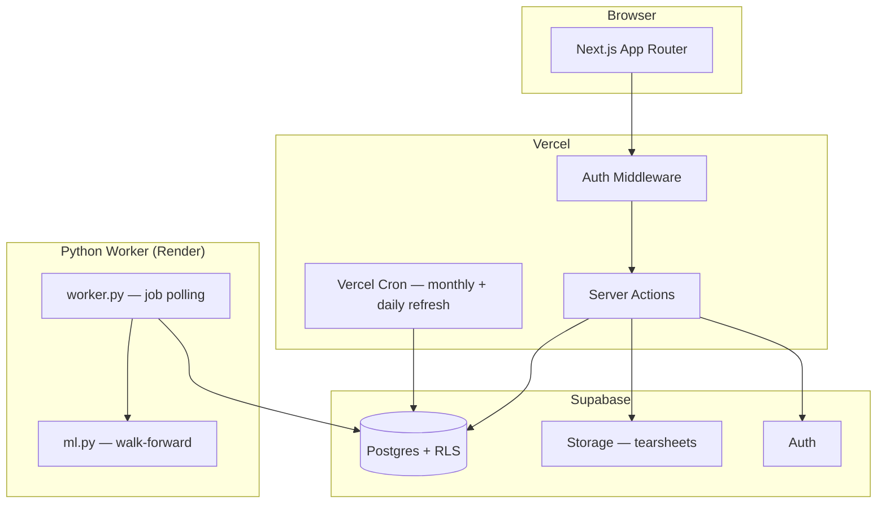

# FactorLab

FactorLab is a quantitative research platform for backtesting systematic equity strategies. It combines a Next.js dashboard, Supabase Postgres database, and a Python compute engine to let you design, run, and compare factor-based strategies against a benchmark — without writing any code.

> **Research only.** Results are historical simulations and do not constitute financial advice or a guarantee of future returns.

---

## Key Features

- **Six strategies** out of the box: equal weight, momentum, low volatility, trend filter, Ridge regression (ML), LightGBM (ML)
- **Preflight-first run creation** — data coverage is checked before a run is queued; missing data is auto-ingested
- **Walk-forward ML** — daily predictions with weekly refit, no look-ahead bias
- **HTML tearsheets** — self-contained performance reports, downloadable from each completed run
- **ML Insights tab** — feature importance, predicted picks, realized vs. predicted return
- **Compare workbench** — side-by-side equity curves and metrics for two runs
- **Guest mode** — try the app with one click, no email required
- **Row-level security** — every user's runs and results are strictly isolated

---

## Strategies

| ID              | Display Name   | Rebalance | Signal                                            |
| --------------- | -------------- | --------- | ------------------------------------------------- |
| `equal_weight`  | Equal Weight   | Monthly   | None — holds all assets at 1/N                    |
| `momentum_12_1` | Momentum 12-1  | Monthly   | 12-month return skipping most recent month        |
| `low_vol`       | Low Volatility | Monthly   | 60-day realized volatility (lowest wins)          |
| `trend_filter`  | Trend Filter   | Monthly   | 200-day benchmark SMA — risk-on/off regime switch |
| `ml_ridge`      | ML Ridge       | Daily     | Walk-forward Ridge regression on 8 daily features |
| `ml_lightgbm`   | ML LightGBM    | Daily     | Walk-forward LightGBM on same 8 features          |

See [docs/strategies.md](docs/strategies.md) for full methodology, warmup requirements, strengths, and limitations.

---

## Universes

| Preset        | Assets    | Description                                                          |
| ------------- | --------- | -------------------------------------------------------------------- |
| **ETF8**      | 8 ETFs    | SPY, QQQ, IWM, EFA, EEM, TLT, GLD, VNQ — cross-asset coverage        |
| **SP100**     | 20 stocks | Large-cap S&P 500 members: AAPL, MSFT, AMZN, GOOGL, META, NVDA, JPM… |
| **NASDAQ100** | 20 stocks | Nasdaq-100 leaders: AAPL, MSFT, NVDA, AMZN, META, TSLA, NFLX, AMD…   |

---

## Supported Benchmarks

SPY, QQQ, IWM, VTI, EFA, EEM, TLT, GLD, VNQ

---

## Architecture



- **Frontend:** Next.js 16 App Router + TypeScript + React 19 + Tailwind v4 + shadcn/ui
- **Database:** Supabase Postgres with row-level security
- **Reports:** Supabase Storage bucket (`reports`) — HTML tearsheets
- **Compute:** Python worker polls `jobs`, writes `equity_curve`, `run_metrics`, `positions`, `model_predictions`
- **Price data:** Yahoo Finance via `yfinance`; optional Stooq fallback

---

## Job Lifecycle

### Run statuses

| Status             | Meaning                                                         |
| ------------------ | --------------------------------------------------------------- |
| `queued`           | Backtest job waiting for the worker                             |
| `waiting_for_data` | Price data is being ingested; backtest will chain automatically |
| `running`          | Worker is executing the backtest                                |
| `completed`        | Results are available                                           |
| `failed`           | Unrecoverable error; see Jobs page for the error message        |

### Job stages (backtest)

`ingest` → `load_data` → `compute_signals` → `rebalance` → `metrics` → `persist` → `report`

### Job stages (ML backtest)

`load_data` → `features` → `train` → `backtest` → `persist` → `report`

### Data ingest job statuses

`queued` → `running` → `completed` / `failed` / `blocked`

- **Blocked** — permanent failure (invalid ticker, delisted symbol). No automatic retry; a "Retry now" button appears on the Data page.
- **Failed** — transient error (network, timeout). Retried with exponential backoff: 60s → 300s → 900s → 3600s (up to 5 attempts).

Worker claims jobs with an atomic `queued → running` transition to prevent double-processing. A 15-second heartbeat detects stalled jobs; stall scanner requeues them after 2 minutes.

---

## Data System

### Data Cutoff Mode

FactorLab uses a singleton `data_state` row to define the effective dataset boundary:

| Field              | Description                                                                    |
| ------------------ | ------------------------------------------------------------------------------ |
| `data_cutoff_date` | Global "Current through" date — all coverage checks and run end dates cap here |
| `update_mode`      | `monthly` (Backtest-ready) or `daily` (Advanced)                               |
| `last_update_at`   | When the cutoff was last advanced                                              |

**Backtest-ready (monthly):** Updated once per month via Vercel Cron at `0 0 1 * *`. Stable; recommended for most users.

**Advanced (daily):** Updated nightly via `/api/cron/daily-refresh` at `0 1 * * *`. Set `ENABLE_DAILY_UPDATES=true` to enable. More recent data, but coverage may be partial until the nightly patch completes.

### Scheduled Refreshes

- Monthly refresh replays the last ~10 trading days plus a ~30 trading day gap-repair window.
- Daily patch replays the last ~5 trading days plus a ~10 trading day gap-repair window.
- The cutoff only advances after **every** job in the batch succeeds.
- Required tickers = all universe preset members + all supported benchmarks.

### How Run Gating Works

On `createRun()`:

1. Preflight check queries coverage for all universe symbols + benchmark over the warmup-adjusted window.
2. **All healthy** → run is `queued` immediately.
3. **Missing data** → run is `waiting_for_data`; data ingest jobs are auto-queued with `preflight_run_id` linking them to the run.
4. **Ticker inception date too late** → error returned with the minimum viable start date; no run is created.
5. When every preflight ingest job settles, the worker chains to the backtest automatically — no user action required.

Coverage thresholds: benchmark ≥ 99%, universe ≥ 98% (99% for momentum/ML strategies).

### Adding a New Benchmark or Universe Ticker

1. Add to `lib/universe-config.ts` (`UNIVERSE_PRESETS`) and/or `BENCHMARK_OPTIONS` in `lib/benchmark.ts`
2. Add its inception date to `TICKER_INCEPTION_DATES` in `lib/supabase/types.ts`
3. Mirror the change in `services/engine/factorlab_engine/worker.py` (`UNIVERSE_PRESETS`)
4. The next scheduled refresh (or a run preflight that needs the ticker) will queue the required ingest automatically

### Fallback Data Provider

Set `FACTORLAB_FALLBACK_PROVIDER=stooq` on the worker to enable a Stooq.com fallback. When yfinance returns fewer than 50% of expected business days, the worker fetches the same range from Stooq and merges the results. No additional packages required.

---

## Run Reproducibility

`runs` stores all parameters needed to reproduce execution:

- `strategy_id`, `benchmark_ticker`, `costs_bps`, `top_n`
- `universe` (preset label) and `universe_symbols` (snapshotted symbol list — source of truth for execution)
- `run_params` (JSON), date range, and status

At execution time the worker snapshots the resolved universe to `runs.universe_symbols`. This prevents config drift between the UI label and actual execution.

---

## Authentication

All routes require authentication. `/login` offers:

- **Sign in** — email + password
- **Create account** — email + password (rate-limited: 10 per IP per hour via Upstash Redis)
- **Continue as Guest** — one-click guest account (`guest_<uuid>@factorlab.local`); rate-limited

Guest accounts are full accounts with complete RLS isolation. Upgrade to a named account at any time in Settings → Account.

### Auth Flow (email confirmation ON)

```
Sign Up → signUpAction → Supabase signUp (emailRedirectTo: /auth/callback)
                      ↓ session = null
        redirect /login?tab=verify&email=user@example.com
                      ↓ user clicks email link
        /auth/callback?code=... → exchangeCodeForSession → redirect /dashboard
                      ↓ expired link
        /login?tab=verify&error=Verification link expired...
```

---

## Environment Variables

### Required

| Variable                        | Where Used                                | Description                                                  |
| ------------------------------- | ----------------------------------------- | ------------------------------------------------------------ |
| `NEXT_PUBLIC_SUPABASE_URL`      | Client + Server                           | Supabase project URL                                         |
| `NEXT_PUBLIC_SUPABASE_ANON_KEY` | Client + Server                           | Supabase anon key (public)                                   |
| `SUPABASE_SERVICE_ROLE_KEY`     | Server only — **never expose to browser** | Service role key for admin operations                        |
| `SUPABASE_REPORTS_BUCKET`       | Server only                               | Storage bucket name for HTML tearsheets (default: `reports`) |
| `CRON_SECRET`                   | Server only                               | Secret to authenticate Vercel Cron requests                  |

### Optional

| Variable                          | Default                       | Description                                                           |
| --------------------------------- | ----------------------------- | --------------------------------------------------------------------- |
| `NEXT_PUBLIC_SITE_URL`            | Derived from request `origin` | Canonical site URL; set for production Vercel deployments             |
| `WORKER_TRIGGER_URL`              | —                             | Worker webhook URL (if using trigger-based invocation)                |
| `WORKER_TRIGGER_SECRET`           | —                             | Secret for worker trigger                                             |
| `ENABLE_DAILY_UPDATES`            | `false`                       | Set to `true` to enable the nightly data patch                        |
| `UPSTASH_REDIS_REST_URL`          | —                             | Upstash Redis REST endpoint (rate limiting)                           |
| `UPSTASH_REDIS_REST_TOKEN`        | —                             | Upstash Redis REST token                                              |
| `SKIP_FACTORLAB_WORKER`           | —                             | Set to `1` to skip starting the local worker alongside the dev server |
| `JOB_TIMEOUT_SECONDS`             | `600`                         | Per-job wall-clock timeout for baseline strategies                    |
| `JOB_TIMEOUT_SECONDS_ML_RIDGE`    | `900`                         | Per-job timeout for ml_ridge                                          |
| `JOB_TIMEOUT_SECONDS_ML_LIGHTGBM` | `1800`                        | Per-job timeout for ml_lightgbm                                       |
| `FACTORLAB_FALLBACK_PROVIDER`     | —                             | Set to `stooq` to enable the Stooq.com fallback data provider         |

Rate limiting is **skipped gracefully** if Upstash env vars are not set (useful for local dev). Create a free Redis database at [upstash.com](https://upstash.com) for production.

---

## Local Setup

### 1. Install JS dependencies

```bash
npm install
```

### 2. Configure environment variables

```bash
cp .env.example .env.local
```

Minimum required:

```
NEXT_PUBLIC_SUPABASE_URL=https://xxx.supabase.co
NEXT_PUBLIC_SUPABASE_ANON_KEY=eyJ...
SUPABASE_SERVICE_ROLE_KEY=eyJ...
SUPABASE_REPORTS_BUCKET=reports
CRON_SECRET=change-me
ENABLE_DAILY_UPDATES=false
```

### 3. Apply database schema

Run in Supabase SQL Editor, in order:

1. `supabase/schema.sql`
2. All files in `supabase/migrations/` in filename order

### 4. Configure Supabase Auth

In your Supabase project → **Authentication → URL Configuration**:

| Setting           | Local dev                  | Production                   |
| ----------------- | -------------------------- | ---------------------------- |
| **Site URL**      | `http://localhost:3000`    | `https://your-domain.com`    |
| **Redirect URLs** | `http://localhost:3000/**` | `https://your-domain.com/**` |

Add both environments to **Redirect URLs** so verification links work in both.

Under **Email** provider:

- **Dev**: disable "Confirm email" for instant sign-in
- **Prod**: enable "Confirm email" for email verification flow

### 5. Start the development server

```bash
npm run dev
```

This starts the Next.js app. Set `SKIP_FACTORLAB_WORKER=1` to run the web app only (without the local Python worker).

---

## Running the Python Worker

### Install

```bash
cd services/engine
pip install -e ".[dev]"
```

This installs all runtime dependencies: NumPy, pandas, scikit-learn, LightGBM, yfinance, supabase-py, and pytest.

### Start the worker

```bash
# From the worker directory — reads env vars from shell
factorlab-engine-worker

# Or via Python module
python -m factorlab_engine.worker
```

The worker polls `jobs WHERE status = 'queued'`, claims each job atomically, executes all stages, and writes results.

### Run a manual ingest

```bash
# Full 10-year history
factorlab-engine-ingest

# Rolling 7-day update
factorlab-engine-ingest --start-date $(date -u -d "7 days ago" +%Y-%m-%d)

# Custom tickers and date range
factorlab-engine-ingest --tickers "AAPL,MSFT,NVDA" --start-date 2020-01-01
```

---

## Worker Deployment (Render)

A [`render.yaml`](render.yaml) at the repo root defines a Render background worker service.

1. Connect the repo at [render.com](https://render.com) → **New → Blueprint** → select this repo
2. Render creates a **Background Worker** (`factorlab-engine-worker`)
3. Set these environment variables in the Render dashboard (`sync: false` — not committed):

   | Variable                    | Description                                              |
   | --------------------------- | -------------------------------------------------------- |
   | `NEXT_PUBLIC_SUPABASE_URL`  | Supabase project URL                                     |
   | `SUPABASE_SERVICE_ROLE_KEY` | Service role key — bypasses RLS, never expose in browser |

4. Click **Deploy** — the worker starts polling the `jobs` table on a 5-second loop

Render restarts automatically on crash. Multiple replicas are safe — atomic job claiming prevents double-processing.

### Alternative: GitHub Actions (polling cron)

Add `NEXT_PUBLIC_SUPABASE_URL` and `SUPABASE_SERVICE_ROLE_KEY` to GitHub Secrets and create a workflow with `schedule: [{cron: "*/10 * * * *"}]` calling `factorlab-engine-worker --once`. Trade-off: up to 10-minute queue latency and GitHub Actions minute consumption.

---

## Test Commands

```bash
# TypeScript type check
npm run typecheck

# Lint (zero warnings allowed)
npm run lint

# Web tests (Vitest)
npm run test:run

# Engine tests (pytest)
cd services/engine && pip install -e ".[dev]" && pytest -q
```

---

## Playwright QA Audit Suite

A browser-based QA harness in `playwright-audit/` executes every strategy × universe × benchmark combination (162 total) and verifies:

- Identity consistency across runs list → detail page → tearsheet
- Preflight correctness — blocks are truthful and actionable
- KPI sanity and UI/tearsheet agreement
- ML Insights completeness for ML runs
- Encoding correctness (no mojibake in tearsheets)

See [`playwright-audit/README.md`](playwright-audit/README.md) for full setup, filtering, and artifact documentation.

---

## Strategy Glossary

See [docs/strategies.md](docs/strategies.md) for full methodology including selection logic, features, warmup requirements, strengths, weaknesses, and metric definitions.

---

## User Guide

See [docs/user-guide.md](docs/user-guide.md) for step-by-step instructions on creating runs, reading results, using the Data page, and account management.

---

## Known Limitations

- **Survivorship bias:** Universe presets are static. Assets delisted or replaced during the backtest window are not removed. This may overstate performance for long windows.
- **Simplified costs:** The cost model applies a flat `bps × turnover` rate. It does not model market impact, bid-ask spread, slippage, or short-selling costs.
- **Data quality:** Price data is sourced from Yahoo Finance via `yfinance`. Gaps are forward-filled in the engine; significant coverage gaps will affect results and may trigger preflight blocks.
- **Research only:** No live brokerage integration. All results are historical simulations.
